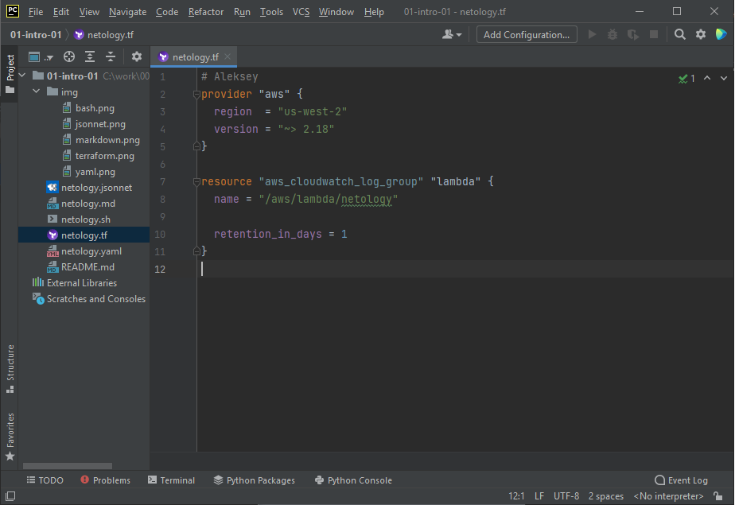
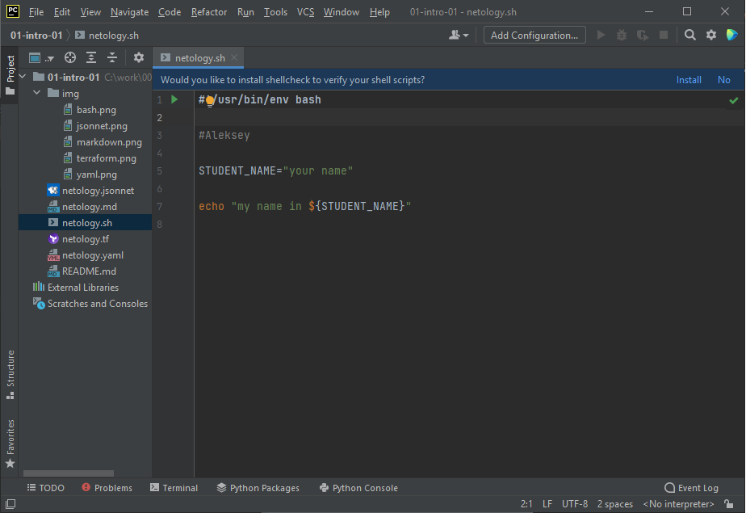
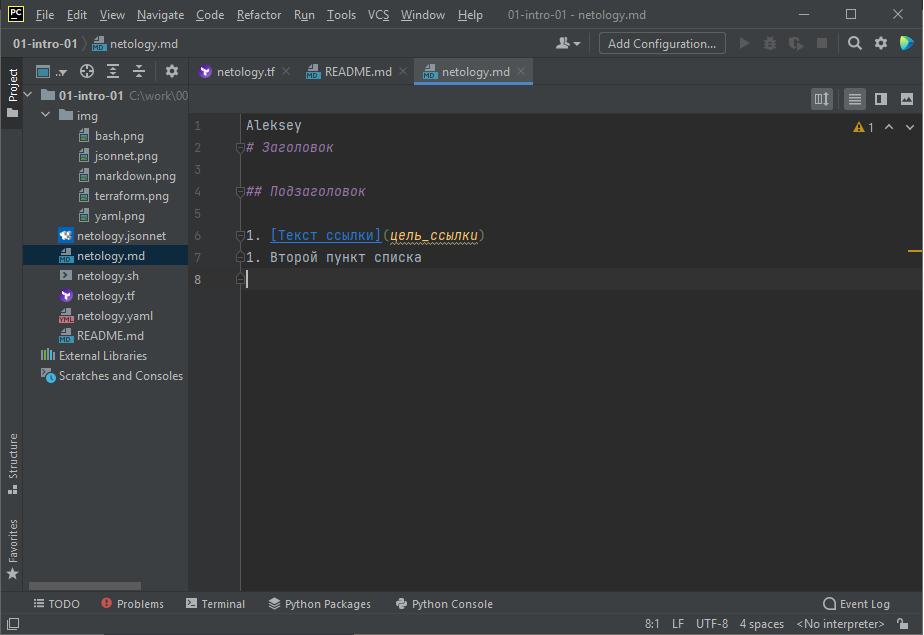
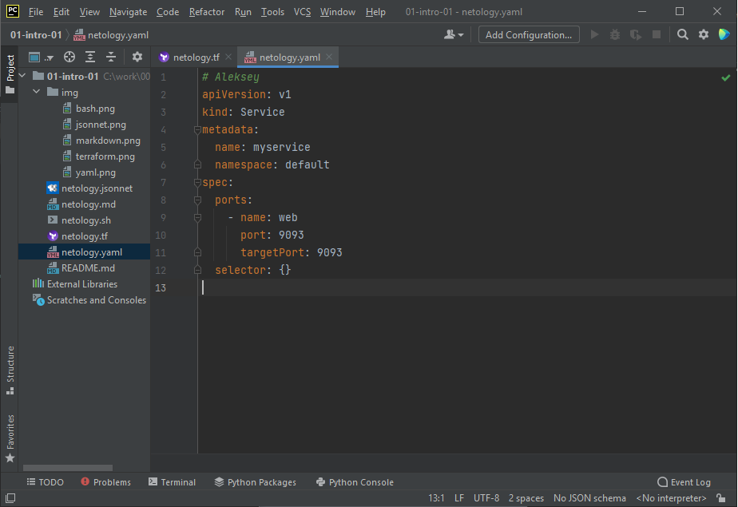
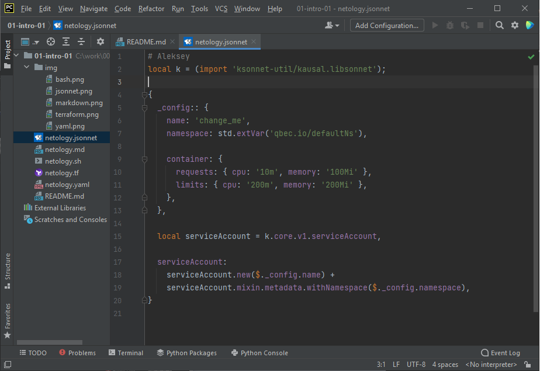

Aleksey
# Домашнее задание к занятию «1.1. Введение в DevOps»

## Задание №1 - Подготовка рабочей среды

Работает подсветка синтаксиса:
    - Terraform: 
    - Bash: 
    - Markdown: 
    - Yaml: 
    - Jsonnet: 

## Задание №2 - Описание жизненного цикла задачи (разработки нового функционала)
1. Постановка задачи
2. Проектирование архитектуры, модулей, функций, сроков реализации...
3. Разработка модулей, тестов для них, проектирование вариантов автоматического развертывания и сбора результатов тестирования.
4. Развертывание версий, и их тестирование различными методами в разных средах тестовых, промышленных и т.п.
5. Согласование результатов с постановщиком задачи 

